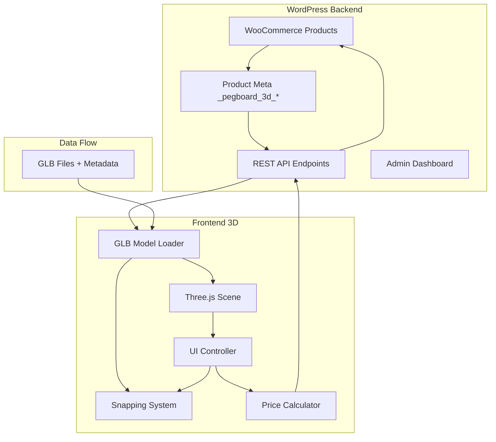

# Design Document - 3D Pegboard Composer

## Overview

Le plugin "3D Pegboard Composer" est une extension WordPress/WooCommerce permettant aux utilisateurs de configurer visuellement des pegboards compatibles SKÅDIS dans un environnement 3D interactif. Le système charge des modèles GLB fournis par l'administrateur, extrait leurs métadonnées, et calcule les positions de placement valides selon l'algorithme de grille duale SKÅDIS.

### Objectifs Principaux
- Intégration transparente avec WooCommerce (produits, prix, panier)
- Rendu 3D performant avec Three.js
- Système de snapping précis basé sur les métadonnées des modèles
- Interface d'administration intuitive pour la gestion des assets 3D

### Stack Technique
- **Backend**: PHP 8+, WordPress 6+, WooCommerce 8+
- **Frontend**: Three.js (dernière version stable), JavaScript ES6+
- **Format 3D**: GLB/glTF 2.0
- **API**: WooCommerce Store API

## Architecture



### Architecture en Couches

1. **Couche Données (WordPress)**
   - Métadonnées produits WooCommerce
   - Fichiers GLB dans la médiathèque
   - Cache des métadonnées extraites

2. **Couche API**
   - REST endpoints pour récupérer les produits 3D
   - WooCommerce Store API pour le panier
   - Endpoints de validation des modèles

3. **Couche Présentation (Three.js)**
   - Rendu WebGL de la scène
   - Gestion des interactions utilisateur
   - Calculs de snapping côté client

## Components and Interfaces

### Backend Components

#### 1. Product_3D_Integration
Gère l'intégration des données 3D dans les fiches produits WooCommerce.

```php
interface Product_3D_Integration {
    public function register_meta_box(): void;
    public function render_meta_box(WP_Post $post): void;
    public function save_meta_data(int $post_id): void;
    public function get_3d_config(int $product_id): array;
    public function extract_glb_metadata(string $file_url): array;
}
```

#### 2. Asset_Dashboard
Interface d'administration pour la gestion globale des assets 3D.

```php
interface Asset_Dashboard {
    public function register_admin_menu(): void;
    public function render_dashboard(): void;
    public function render_pegboards_list(): void;
    public function render_accessories_list(): void;
    public function get_statistics(): array;
    public function bulk_update(array $product_ids, array $data): bool;
}
```

#### 3. Model_Validator
Valide les fichiers GLB et leurs métadonnées.

```php
interface Model_Validator {
    public function validate_glb(string $file_path): ValidationResult;
    public function validate_pegboard_metadata(array $metadata): ValidationResult;
    public function validate_accessory_metadata(array $metadata): ValidationResult;
    public function get_validation_errors(): array;
}

class ValidationResult {
    public bool $is_valid;
    public array $errors;
    public array $warnings;
    public array $extracted_metadata;
}
```

#### 4. REST_Controller
Expose les endpoints API pour le frontend.

```php
interface REST_Controller {
    public function register_routes(): void;
    public function get_pegboards(WP_REST_Request $request): WP_REST_Response;
    public function get_accessories(WP_REST_Request $request): WP_REST_Response;
    public function get_product_3d_data(int $product_id): array;
}
```

### Frontend Components

#### 5. SceneManager
Gère l'initialisation et le rendu de la scène Three.js.

```typescript
interface SceneManager {
    init(container: HTMLElement): void;
    render(): void;
    resize(): void;
    addObject(object: THREE.Object3D): void;
    removeObject(object: THREE.Object3D): void;
    getIntersectedObject(event: MouseEvent): THREE.Object3D | null;
}
```

#### 6. ModelLoader
Charge les modèles GLB et extrait leurs métadonnées.

```typescript
interface ModelLoader {
    loadModel(url: string): Promise<LoadedModel>;
    extractPegboardMetadata(model: THREE.Object3D): PegboardMetadata;
    extractAccessoryMetadata(model: THREE.Object3D): AccessoryMetadata;
    getCachedModel(url: string): LoadedModel | null;
}

interface PegboardMetadata {
    panel_width_cm: number;
    panel_height_cm: number;
    grid_spacing_mm: number;
    grid_offset_mm: number;
    border_margin_mm: number;
    slot_width_mm: number;
    slot_height_mm: number;
}

interface AccessoryMetadata {
    peg_positions: Vector3[];
    peg_count: number;
    snap_mode: 'single_slot' | 'dual_slot' | 'rail';
    orientation: 'front' | 'angled';
    load_capacity_g: number;
}
```

#### 7. SnappingSystem
Calcule les positions de snapping valides.

```typescript
interface SnappingSystem {
    calculateSnapPoint(
        accessory: AccessoryMetadata,
        pegboard: PegboardMetadata,
        cursorPosition: Vector3
    ): SnapResult;
    
    validatePlacement(
        pegPositions: Vector3[],
        pegboard: PegboardMetadata
    ): boolean;
    
    getGridPositions(pegboard: PegboardMetadata): GridPosition[];
}

interface SnapResult {
    isValid: boolean;
    snappedPosition: Vector3;
    gridPositions: GridPosition[];
}

interface GridPosition {
    x: number;
    y: number;
    grid: 'A' | 'B';
}
```

#### 8. PlacementCalculator
Calcule les positions de placement des accessoires.

```typescript
interface PlacementCalculator {
    computePegWorldPositions(
        accessory: THREE.Object3D,
        cursorPosition: Vector3
    ): Vector3[];
    
    findNearestValidPosition(
        pegPositions: Vector3[],
        pegboard: PegboardMetadata
    ): Vector3 | null;
    
    checkCollision(
        newAccessory: THREE.Object3D,
        existingAccessories: THREE.Object3D[]
    ): boolean;
}
```

#### 9. MultiPanelManager
Gère l'assemblage de plusieurs pegboards.

```typescript
interface MultiPanelManager {
    addPanel(pegboard: THREE.Object3D, metadata: PegboardMetadata): void;
    removePanel(pegboard: THREE.Object3D): void;
    getAdjacentPosition(existingPanels: Panel[]): Vector3;
    calculateGlobalGrid(panels: Panel[]): GlobalGrid;
    getPanelAtPosition(position: Vector3): Panel | null;
}

interface Panel {
    object: THREE.Object3D;
    metadata: PegboardMetadata;
    position: Vector3;
    gridOffset: Vector2;
}

interface GlobalGrid {
    panels: Panel[];
    totalWidth: number;
    totalHeight: number;
    gridPositions: GridPosition[];
}
```

#### 10. PriceCalculator
Calcule le prix total de la configuration.

```typescript
interface PriceCalculator {
    updatePrice(sceneItems: SceneItem[]): void;
    getTotal(): number;
    getItemizedList(): PriceItem[];
    applyDebounce(callback: () => void, delay: number): void;
}

interface SceneItem {
    productId: number;
    quantity: number;
    variationId?: number;
}

interface PriceItem {
    productId: number;
    name: string;
    unitPrice: number;
    quantity: number;
    subtotal: number;
}
```

#### 11. CartIntegration
Gère l'ajout au panier WooCommerce.

```typescript
interface CartIntegration {
    addToCart(items: SceneItem[]): Promise<CartResponse>;
    showLoadingState(): void;
    hideLoadingState(): void;
    handleSuccess(response: CartResponse): void;
    handleError(error: Error): void;
}
```

#### 12. UIController
Gère les interactions utilisateur.

```typescript
interface UIController {
    init(): void;
    showContextMenu(object: THREE.Object3D, position: Vector2): void;
    hideContextMenu(): void;
    startDrag(accessory: THREE.Object3D): void;
    endDrag(): void;
    highlightSnapPoint(position: Vector3): void;
    showEmptyStateMessage(): void;
}
```

## Data Models

### WordPress Meta Data Structure

```php
// Pegboard Product Meta
[
    '_pegboard_3d_type' => 'pegboard',
    '_pegboard_3d_glb_url' => 'https://site.com/wp-content/uploads/model.glb',
    '_pegboard_3d_panel_width_cm' => 36,
    '_pegboard_3d_panel_height_cm' => 56,
    '_pegboard_3d_grid_spacing_mm' => 40,
    '_pegboard_3d_grid_offset_mm' => 20,
    '_pegboard_3d_border_margin_mm' => 18,
    '_pegboard_3d_slot_count_x' => 8,
    '_pegboard_3d_slot_count_y' => 13,
]

// Accessory Product Meta
[
    '_pegboard_3d_type' => 'accessory',
    '_pegboard_3d_glb_url' => 'https://site.com/wp-content/uploads/hook.glb',
    '_pegboard_3d_peg_count' => 1,
    '_pegboard_3d_peg_positions' => '[{"x":0,"y":0,"z":0}]',
    '_pegboard_3d_snap_mode' => 'single_slot',
    '_pegboard_3d_orientation' => 'front',
    '_pegboard_3d_load_capacity_g' => 500,
]
```

### GLB userData Structure

```javascript
// Pegboard userData (from Blender Custom Properties)
{
    model_type: 'pegboard',
    panel_width_cm: 36,
    panel_height_cm: 56,
    grid_spacing_mm: 40,
    grid_offset_mm: 20,
    border_margin_mm: 18,
    slot_width_mm: 5,
    slot_height_mm: 15
}

// Accessory userData
{
    model_type: 'accessory',
    peg_count: 2,
    snap_mode: 'dual_slot',
    orientation: 'front',
    load_capacity_g: 1000
}
// + Empty objects named "peg_01", "peg_02" with their positions
```

### Scene State Model

```typescript
interface SceneState {
    panels: PanelInstance[];
    accessories: AccessoryInstance[];
    selectedObject: THREE.Object3D | null;
    isDragging: boolean;
    totalPrice: number;
}

interface PanelInstance {
    id: string;
    productId: number;
    object: THREE.Object3D;
    metadata: PegboardMetadata;
    position: Vector3;
    attachedAccessories: string[];
}

interface AccessoryInstance {
    id: string;
    productId: number;
    variationId?: number;
    object: THREE.Object3D;
    metadata: AccessoryMetadata;
    position: Vector3;
    parentPanelId: string;
    gridPositions: GridPosition[];
}
```

## Correctness Properties

*A property is a characteristic or behavior that should hold true across all valid executions of a system-essentially, a formal statement about what the system should do. Properties serve as the bridge between human-readable specifications and machine-verifiable correctness guarantees.*

### Property Reflection

After analyzing all acceptance criteria, the following redundancies were identified and consolidated:
- Properties 12.1-12.4 (metadata extraction for pegboards) consolidated into Property 1
- Properties 13.1-13.5 (metadata extraction for accessories) consolidated into Property 2
- Properties 7.1-7.3 (price calculations) consolidated into Property 5
- Properties 5.2, 14.2 (dual-grid algorithm) consolidated into Property 3

### Core Properties

**Property 1: Pegboard Metadata Round-Trip**
*For any* valid pegboard GLB model with userData containing panel dimensions and grid parameters, serializing the userData to JSON and deserializing back SHALL produce an equivalent metadata object with no data loss.
**Validates: Requirements 4.5, 12.1, 12.2, 12.3, 12.4**

**Property 2: Accessory Metadata Extraction Completeness**
*For any* valid accessory GLB model containing Empty objects named "peg_*", the Metadata_Reader SHALL extract all peg positions as relative coordinates from the accessory origin, and the count of extracted positions SHALL equal the number of peg_* Empty objects in the model.
**Validates: Requirements 4.3, 13.1, 13.2**

**Property 3: Dual-Grid Snapping Algorithm Correctness**
*For any* cursor position P(x, y) on a pegboard plane, the Snapping_System SHALL return the nearest valid grid position where:
- Grid A positions satisfy: x_a = round(x/40)*40, y_a = round(y/40)*40
- Grid B positions satisfy: x_b = round((x-20)/40)*40+20, y_b = round((y-20)/40)*40+20
- The returned position minimizes Euclidean distance to P
**Validates: Requirements 5.2, 14.2, 14.5**

**Property 4: Multi-Peg Placement Validation**
*For any* accessory with N peg points (N ≥ 1), placement SHALL be valid if and only if ALL N peg points align with valid grid positions on the pegboard(s). If any single peg point falls outside valid grid positions or pegboard bounds, the entire placement SHALL be rejected.
**Validates: Requirements 5.3, 5.4, 14.3, 14.4**

**Property 5: Price Calculation Consistency**
*For any* scene configuration containing M distinct products with quantities Q1, Q2, ..., QM and unit prices P1, P2, ..., PM, the total price SHALL equal Σ(Qi × Pi) for i=1 to M. Adding an accessory SHALL increase the total by its unit price, and removing an accessory SHALL decrease the total by its unit price.
**Validates: Requirements 7.1, 7.2, 7.3**

**Property 6: Collision Detection Completeness**
*For any* two accessories A and B in the scene, if their bounding boxes overlap on the XY plane (pegboard surface), the Snapping_System SHALL prevent placement of the second accessory and provide visual feedback.
**Validates: Requirements 5.5**

**Property 7: Panel Removal Cascade**
*For any* pegboard panel P with N attached accessories, removing P from the scene SHALL result in all N accessories being removed, and the total price SHALL decrease by the sum of P's price plus all N accessories' prices.
**Validates: Requirements 6.3**

**Property 8: Grid Continuity Across Panels**
*For any* two adjacent pegboard panels P1 and P2, the combined grid SHALL maintain 40mm spacing continuity across the boundary, accounting for border_margin_mm of each panel. An accessory spanning both panels SHALL have all its peg points on valid grid positions of the combined grid.
**Validates: Requirements 6.2, 6.5**

**Property 9: Cart Request Completeness**
*For any* scene configuration with N items (panels + accessories), the "Add to Cart" action SHALL generate a cart request containing exactly N line items, each with correct product_id, quantity, and variation_id (if applicable).
**Validates: Requirements 8.1, 8.2**

**Property 10: Security Input Sanitization**
*For any* user input string S containing potentially malicious content (HTML, SQL, JavaScript), the Security_Manager SHALL sanitize S such that the stored/output value contains no executable code while preserving legitimate alphanumeric content.
**Validates: Requirements 11.2, 11.5**

**Property 11: File Type Validation**
*For any* uploaded file F, the Security_Manager SHALL accept F if and only if F has a valid GLB file signature (magic bytes) and .glb extension. All non-GLB files SHALL be rejected with an appropriate error message.
**Validates: Requirements 11.4**

**Property 12: Metadata Default Fallback**
*For any* pegboard GLB model with missing metadata fields, the Metadata_Reader SHALL use SKÅDIS default values (grid_spacing_mm=40, grid_offset_mm=20, slot_width_mm=5, slot_height_mm=15) and log a warning for each missing field.
**Validates: Requirements 12.5**

**Property 13: Canvas Responsive Sizing**
*For any* browser window resize event, the 3D_Scene_Renderer SHALL update the canvas dimensions to match the parent container dimensions within 1 pixel tolerance.
**Validates: Requirements 3.5**

**Property 14: Shortcode Attribute Propagation**
*For any* shortcode [pegboard_configurator attr1="val1" attr2="val2"], all attributes SHALL be passed to the JavaScript configurator via wp_localize_script and be accessible in the JS configuration object.
**Validates: Requirements 10.3**

**Property 15: Model Cache Efficiency**
*For any* GLB model URL loaded twice within the same session, the second load SHALL retrieve the model from browser cache without making a network request.
**Validates: Requirements 4.4**

## Error Handling

### Backend Error Handling

| Error Type | Trigger | Response | User Message |
|------------|---------|----------|--------------|
| Invalid GLB File | Upload of non-GLB file | Reject upload, return 400 | "Le fichier doit être au format GLB" |
| Missing Metadata | GLB without required userData | Use defaults, log warning | "Métadonnées manquantes, valeurs par défaut appliquées" |
| Invalid Product ID | Non-existent WooCommerce product | Return 404 | "Produit non trouvé" |
| Permission Denied | Unauthorized REST request | Return 403 | "Accès non autorisé" |
| Nonce Verification Failed | Invalid/expired nonce | Return 403 | "Session expirée, veuillez rafraîchir la page" |
| Database Error | wp_postmeta write failure | Log error, return 500 | "Erreur de sauvegarde, veuillez réessayer" |

### Frontend Error Handling

| Error Type | Trigger | Response | User Feedback |
|------------|---------|----------|---------------|
| WebGL Not Supported | Browser without WebGL | Show fallback message | "Votre navigateur ne supporte pas la 3D" |
| Model Load Failed | Network error or corrupt GLB | Retry 3x, then show error | "Impossible de charger le modèle 3D" |
| Invalid Placement | Accessory outside bounds | Return to previous position | Visual red highlight |
| Collision Detected | Overlapping accessories | Prevent drop | Visual red highlight + tooltip |
| Cart API Error | WooCommerce API failure | Show retry button | "Erreur d'ajout au panier, réessayer?" |
| Price Sync Error | Product price unavailable | Show "Prix indisponible" | Gray out price display |

### Error Recovery Strategies

1. **Model Loading**: Implement exponential backoff retry (1s, 2s, 4s) before showing error
2. **Cart Operations**: Queue failed operations for retry when connection restored
3. **State Corruption**: Implement scene state serialization for recovery after page refresh
4. **Validation Errors**: Provide specific guidance linking to documentation

## Testing Strategy

### Testing Framework Selection

- **PHP Unit Tests**: PHPUnit 10+ with WordPress test suite (wp-phpunit)
- **JavaScript Unit Tests**: Vitest for fast ES6+ testing
- **Property-Based Tests**: fast-check library for JavaScript
- **Integration Tests**: Cypress for E2E testing with WooCommerce

### Unit Testing Approach

Unit tests verify specific examples and edge cases:

```php
// PHP Example: Test meta box registration
public function test_meta_box_registered_on_product_edit() {
    // Verify meta box exists on product edit screen
}

// PHP Example: Test sanitization
public function test_glb_url_sanitization() {
    $input = '<script>alert("xss")</script>https://example.com/model.glb';
    $sanitized = Security_Manager::sanitize_glb_url($input);
    $this->assertEquals('https://example.com/model.glb', $sanitized);
}
```

```typescript
// TypeScript Example: Test metadata extraction
describe('ModelLoader', () => {
    it('should extract pegboard dimensions from userData', async () => {
        const model = await loader.loadModel('test-pegboard.glb');
        const metadata = loader.extractPegboardMetadata(model);
        expect(metadata.panel_width_cm).toBe(36);
        expect(metadata.panel_height_cm).toBe(56);
    });
});
```

### Property-Based Testing Approach

Property tests verify universal properties across all valid inputs using fast-check:

```typescript
import * as fc from 'fast-check';

// **Feature: woocommerce-3d-pegboard-configurator, Property 3: Dual-Grid Snapping Algorithm Correctness**
describe('SnappingSystem Properties', () => {
    it('should always return nearest valid grid position', () => {
        fc.assert(
            fc.property(
                fc.float({ min: 0, max: 360 }), // x position in mm
                fc.float({ min: 0, max: 560 }), // y position in mm
                (x, y) => {
                    const result = snappingSystem.calculateSnapPoint(x, y);
                    
                    // Verify result is on Grid A or Grid B
                    const isGridA = result.x % 40 === 0 && result.y % 40 === 0;
                    const isGridB = (result.x - 20) % 40 === 0 && (result.y - 20) % 40 === 0;
                    expect(isGridA || isGridB).toBe(true);
                    
                    // Verify it's the nearest valid position
                    const distToResult = Math.sqrt((x - result.x) ** 2 + (y - result.y) ** 2);
                    // No other valid grid point should be closer
                    return distToResult <= 20 * Math.sqrt(2); // Max distance to nearest grid point
                }
            ),
            { numRuns: 100 }
        );
    });
});

// **Feature: woocommerce-3d-pegboard-configurator, Property 5: Price Calculation Consistency**
describe('PriceCalculator Properties', () => {
    it('should maintain price consistency for add/remove operations', () => {
        fc.assert(
            fc.property(
                fc.array(fc.record({
                    productId: fc.integer({ min: 1, max: 1000 }),
                    price: fc.float({ min: 0.01, max: 1000, noNaN: true }),
                    quantity: fc.integer({ min: 1, max: 10 })
                }), { minLength: 1, maxLength: 20 }),
                (items) => {
                    const calculator = new PriceCalculator();
                    
                    // Add all items
                    items.forEach(item => {
                        for (let i = 0; i < item.quantity; i++) {
                            calculator.addItem(item.productId, item.price);
                        }
                    });
                    
                    // Calculate expected total
                    const expectedTotal = items.reduce(
                        (sum, item) => sum + (item.price * item.quantity), 
                        0
                    );
                    
                    expect(calculator.getTotal()).toBeCloseTo(expectedTotal, 2);
                }
            ),
            { numRuns: 100 }
        );
    });
});

// **Feature: woocommerce-3d-pegboard-configurator, Property 1: Pegboard Metadata Round-Trip**
describe('Metadata Serialization Properties', () => {
    it('should preserve metadata through JSON round-trip', () => {
        fc.assert(
            fc.property(
                fc.record({
                    panel_width_cm: fc.float({ min: 10, max: 200, noNaN: true }),
                    panel_height_cm: fc.float({ min: 10, max: 200, noNaN: true }),
                    grid_spacing_mm: fc.integer({ min: 20, max: 100 }),
                    grid_offset_mm: fc.integer({ min: 0, max: 50 }),
                    border_margin_mm: fc.integer({ min: 0, max: 50 })
                }),
                (metadata) => {
                    const serialized = JSON.stringify(metadata);
                    const deserialized = JSON.parse(serialized);
                    
                    expect(deserialized.panel_width_cm).toBeCloseTo(metadata.panel_width_cm, 5);
                    expect(deserialized.panel_height_cm).toBeCloseTo(metadata.panel_height_cm, 5);
                    expect(deserialized.grid_spacing_mm).toBe(metadata.grid_spacing_mm);
                    expect(deserialized.grid_offset_mm).toBe(metadata.grid_offset_mm);
                    expect(deserialized.border_margin_mm).toBe(metadata.border_margin_mm);
                }
            ),
            { numRuns: 100 }
        );
    });
});
```

### Test Coverage Requirements

| Component | Unit Tests | Property Tests | Integration Tests |
|-----------|------------|----------------|-------------------|
| Product_3D_Integration | Meta box rendering, save/load | Data persistence consistency | WooCommerce product flow |
| Model_Loader | GLB parsing, cache behavior | Metadata round-trip | Full model load cycle |
| SnappingSystem | Edge cases, boundaries | Dual-grid algorithm | Drag-drop interaction |
| PriceCalculator | Add/remove operations | Price consistency | Cart synchronization |
| Security_Manager | Sanitization, validation | Input sanitization completeness | Form submission flow |
| MultiPanelManager | Panel positioning | Grid continuity | Multi-panel assembly |

### Continuous Integration

- Run PHPUnit tests on every commit
- Run Vitest + fast-check on every commit
- Run Cypress E2E tests on pull requests
- Minimum 80% code coverage for core components
- Property tests configured for 100 iterations minimum

